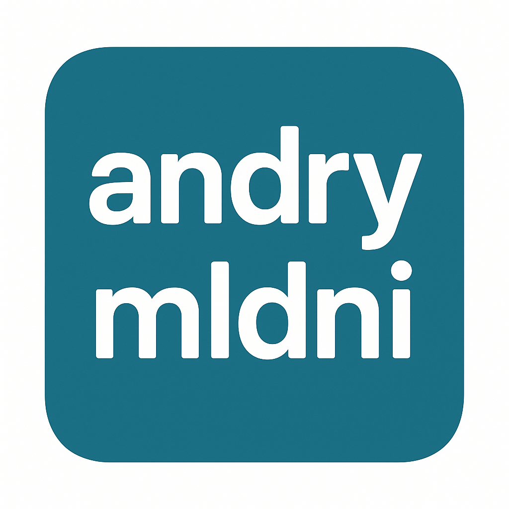

# 🚀 Andry – Modern Portfolio Website

[](https://nextjs.org/)
[](https://tailwindcss.com/)
[](https://www.framer.com/motion/)
[](LICENSE)

> Website portfolio modern & responsif dengan desain premium, efek animasi halus, dan optimasi performa.

---

## 📸 Preview


Live Demo: **[andrymldni.dev](https://andrymldni.dev)**

---

## ✨ Fitur Utama
- 🎯 **Desain Modern & Responsif** – Optimal di desktop & mobile.
- 🎞 **Animasi Halus** – Framer Motion untuk transisi yang lembut.
- 📌 **Navigasi Aktif** – Navbar dinamis sesuai posisi scroll.
- 🌟 **Hero Dinamis** – Headline berganti otomatis + avatar glow effect.
- 📂 **Section Lengkap**:
  - **About** – Profil singkat, kontak, dan CV.
  - **Resume** – Pengalaman kerja, organisasi, pendidikan, sertifikasi.
  - **Projects** – Showcase proyek dengan gambar, stack, link.
  - **Contact** – Form pesan via Gmail/email klien.
- 🎨 **Dark Premium Theme** – Aksen gradien & efek glassmorphism.
- ♿ **Aksesibilitas** – Mendukung prefers-reduced-motion.

---

## 🛠️ Teknologi
- [Next.js 13 (App Router)](https://nextjs.org/)
- [React 18](https://react.dev/)
- [Tailwind CSS 3](https://tailwindcss.com/)
- [Framer Motion](https://www.framer.com/motion/)
- [Lucide Icons](https://lucide.dev/)
- [TypeScript](https://www.typescriptlang.org/)

---

## 📂 Struktur Proyek
```
src/
 ├─ app/
 │   ├─ layout.tsx      # Layout utama (Navbar, Footer, background)
 │   ├─ page.tsx        # Halaman utama
 │   └─ globals.css     # Style global + custom class
 └─ components/
     ├─ Navbar.tsx
     ├─ Footer.tsx
     ├─ Hero.tsx
     ├─ About.tsx
     ├─ Resume.tsx
     ├─ Projects.tsx
     ├─ Section.tsx
     └─ Contact.tsx
```

---

## ⚙️ Instalasi & Menjalankan Lokal

> Pastikan Node.js ≥ 18 sudah terpasang.

```bash
# Clone repo
git clone https://github.com/username/portfolio.git
cd portfolio

# Install dependencies
npm install

# Jalankan development server
npm run dev
```

Buka di browser: [http://localhost:3000](http://localhost:3000)

---

## 🔧 Konfigurasi Environment
Buat file `.env.local` di root proyek:
```env
NEXT_PUBLIC_CONTACT_EMAIL=youremail@example.com
```
Jika tidak diisi, default akan menggunakan `andrymldni@gmail.com`.

---

## ☁️ Deploy ke Vercel
1. Fork atau clone repository ini.
2. Login ke [Vercel](https://vercel.com/).
3. Import repository ke Vercel.
4. Tambahkan environment variable `NEXT_PUBLIC_CONTACT_EMAIL`.
5. Deploy dan nikmati hasilnya ✨.

---

## 📜 Lisensi
Proyek ini dilisensikan di bawah **MIT License** – silakan lihat file [LICENSE](LICENSE) untuk detail.

---

💡 **Dibuat dengan semangat oleh [Andry](https://andrymldni.dev)**
